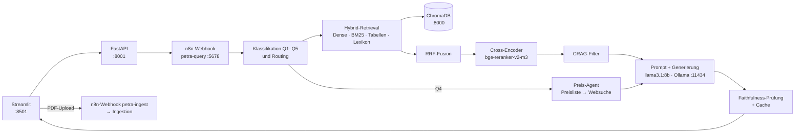

# PETRA-RAG

Lokales KI-Produktberatungssystem für Automatisierungskomponenten (Weidmüller-Datenblätter, Kataloge, Preislisten) auf Basis von Retrieval-Augmented Generation, n8n-Orchestrierung und lokalen Sprachmodellen.

**Projektarbeit Mechatronik** · Hochschule Ruhr West · SS 2026
**Autor:** Al Muataz Al-Gunaid · **Betreuer:** Prof. Dr.-Ing. Kai Daniel
**Stand:** Endstand der Projektarbeit, 04.10.2026 – n8n-Workflow „Schritt 7: Einstellungen wirksam“ + Reparatur des Web-Agenten

Alles läuft lokal auf einem PC mit NVIDIA-GPU. Für Fragen werden keine Daten an Cloud-Dienste geschickt; nur die optionale Preis-Websuche geht ins Internet.

---

## Lieferumfang der Abgabe

Die Abgabe besteht aus zwei Teilen, weil die Daten für GitHub zu groß sind:

| Teil | Inhalt | Ablage |
|---|---|---|
| **Code** | Docker-Dateien, Python-Backend, Streamlit-Frontend, n8n-Workflows, Evaluation, Skripte | GitHub: `https://github.com/Al-Gunaid/petra-rag` |
| **Daten** | PDFs, verarbeitete Dateien, ChromaDB, BM25-Index, Produkt-Lexikon, Evaluationsergebnisse | Sciebo: `https://hs-rw.sciebo.de/s/jXFPrkCt789WPnq` |

Die Sprachmodelle (Ollama, Reranker) sind **nicht** im Sciebo-Paket, weil sie frei herunterladbar sind; sie werden mit `scripts/modelle_laden.sh` geladen (Abschnitt [Installation](#installation), Schritt 6).

**Schnellstart für die Begutachtung:** Installation Schritte 1–7 → n8n einrichten → Aufwärmen → http://localhost:8501. Ein erneuter Import der PDFs ist nicht nötig, der fertige Suchindex kommt aus Sciebo.

---

## Inhalt

1. [Funktionen](#funktionen)
2. [Architektur](#architektur)
3. [Repository-Struktur](#repository-struktur)
4. [Voraussetzungen](#voraussetzungen)
5. [Installation](#installation)
6. [n8n einrichten und Workflow aktivieren](#n8n-einrichten-und-workflows-aktivieren)
7. [Dokumente importieren](#dokumente-importieren)
8. [Aufwärmen und prüfen](#aufwärmen-und-prüfen)
9. [Bedienung](#bedienung)
10. [Evaluation](#evaluation)
11. [Konfiguration](#konfiguration)
12. [Betrieb: Starten, Stoppen, Aktualisieren](#betrieb-starten-stoppen-aktualisieren)
13. [Fehlerbehebung](#fehlerbehebung)
14. [Bekannte Einschränkungen](#bekannte-einschränkungen)

---

## Funktionen

| Fragetyp | Beispiel | Verhalten |
|---|---|---|
| Q1 Produktspezifikation | „Wie hoch ist der Nennstrom der WDU 2.5?“ | Wert mit Artikelnummer und Quelle (Datei, Seite) |
| Q2 Produktvergleich | „Vergleiche TRS 24VDC 1CO und TRS 24VDC 2CO …“ | Vergleichstabelle, je Produkt eigenes Retrieval |
| Q3 Produktsuche | „Ich brauche eine 4-polige M12-Leitung mit LED …“ | passende Produkte aus den Dokumenten |
| Q4 Preisanfrage | „Was kostet das PRO ECO3 240W 24V 10A II?“ | Listenpreis aus Preisliste, optional Web-Preis mit URL und Datum |
| Q5 Allgemeine Frage | „Was bedeutet die Anschlusstechnik PUSH IN?“ | Erklärung nur aus den Dokumenten |
| Negativfall | „Welche IP-Schutzart hat die WDU 2.5?“ | „nicht belegt“ statt erfundener Werte |

Weitere Funktionen: PDF-Import über die Oberfläche (inkl. OCR für Scans), Antwort-Cache (wiederholte Fragen in ≈ 0,3 s), Faithfulness-Prüfung jeder Antwort, Einstellungen für Modell, Temperatur, Top-K und Web-Agent, eingebaute Evaluation mit RAGAS.

---

## Architektur



| Komponente | Technik | Container |
|---|---|---|
| Oberfläche | Streamlit | `petra_frontend` |
| Backend (Ingestion, Retrieval, Reranker, Cache, Preis-Agent) | FastAPI, Python | `petra_ingestion` |
| Orchestrierung | n8n | `petra_n8n` |
| Vektordatenbank | ChromaDB | `petra-chromadb` |
| Sprachmodelle | Ollama: llama3.1:8b (Antworten), bge-m3 (Embeddings) | `petra_ollama` |
| Reranker | BAAI/bge-reranker-v2-m3 (sentence-transformers) | im Backend |

---

## Repository-Struktur

```
petra-rag/
├── README.md
├── .gitignore
├── docker/
│   ├── docker-compose.yml          # alle Dienste
│   ├── Dockerfile                  # Images "backend" und "frontend"
│   └── .env.example                # Vorlage für docker/.env
├── data/src/pipeline/              # Backend: FastAPI, Ingestion, backend/petra_hybrid/ (wird ins Image kopiert)
├── frontend/                       # Streamlit-App (Chat, Einstellungen, Ingestion, Dashboard, Evaluation)
├── n8n_workflows/
│   ├── PETRA-RAG_Schritt_7_Einstellungen_wirksam.json   # Query-Workflow (Endstand)
│   └── PDF-Pipline-Parsing.json                         # Ingestion-Workflow
├── evaluation/
│   ├── evaluate_petra.py           # Evaluation mit RAGAS
│   ├── run_eval_schritt.sh         # Lauf unter festen Bedingungen
│   ├── test_produktberatung.py     # Abnahmetest aller Fragetypen
│   ├── diagnose_petra.py           # Diagnose der Retrieval-Pfade
│   ├── Optimierungsprotokoll.md    # Schritte s0–s7 mit Messwerten und Entscheidungen
│   ├── testset/testset_v2.xlsx     # Testset (75 Fälle, aus frontend/evaluation/testfaelle.json)
│   └── baseline/ragas_evaluation_20260923_213553.xlsx   # Vergleichsdatei
├── scripts/
│   ├── modelle_laden.sh            # Ollama-Modelle + Reranker herunterladen
│   ├── aufwaermen.sh               # Dienste prüfen, Modelle in die GPU laden
│   ├── daten_packen.sh             # Datenordner für Sciebo verpacken
│   └── daten_einspielen.sh         # Sciebo-Paket nach /mnt/petra-rag entpacken
├── ausblick/                       # Workflow „Schritt 8“, NICHT eingesetzt (siehe Bekannte Einschränkungen)
└── tools/
    └── abgabe_pruefen.sh           # Prüfung vor dem Hochladen (keine Passwörter, keine großen Dateien)
```

**Nicht im Repository** (zu groß oder privat): PDFs, ChromaDB, BM25-Index, Produkt-Lexikon, Modellgewichte, `docker/.env`, `docker/n8n_data`. Die Daten liegen im Betrieb unter `/mnt/petra-rag/` und werden über Sciebo bereitgestellt.

---

## Voraussetzungen

| | Minimum | Im Projekt verwendet |
|---|---|---|
| Betriebssystem | Linux (Ubuntu 22.04/24.04) | Ubuntu |
| GPU | NVIDIA mit 8 GB VRAM | RTX 4060, 8 GB |
| Software | Docker Engine + Compose v2, NVIDIA-Treiber, NVIDIA Container Toolkit | |
| Speicherplatz | ≥ 10 GB für Modelle + Platz für Daten aus Sciebo (Größe siehe `MANIFEST.txt` im Sciebo-Ordner) ; Evaluation zusätzlich ≈ 20 GB (qwen2.5:32b) | |
| Internet | nur für Installation, Modell-Download, Sciebo-Download und optionale Preis-Websuche | |

GPU-Zugriff aus Docker prüfen:

```bash
docker run --rm --gpus all nvidia/cuda:12.4.1-base-ubuntu22.04 nvidia-smi
```

Zeigt das die Grafikkarte an, ist alles bereit. Sonst zuerst das NVIDIA Container Toolkit installieren.

---

## Installation

### 1. Repository holen

```bash
git clone https://github.com/Al-Gunaid/petra-rag.git
cd petra-rag
```

### 2. Datenordner anlegen

```bash
sudo mkdir -p /mnt/petra-rag/{pdfs,processed,chroma_db,ollama,hf_cache,eval}
sudo chown -R $USER /mnt/petra-rag
```

Soll ein anderer Ordner verwendet werden, in `docker/docker-compose.yml` alle Vorkommen von `/mnt/petra-rag` ersetzen.

### 3. Daten aus Sciebo einspielen

Den Sciebo-Ordner herunterladen, z. B. nach `~/petra-daten`. Enthält er `.tar.gz`-Archive mit `SHA256SUMS`, einspielen mit:

```bash
bash scripts/daten_einspielen.sh ~/petra-daten
```

Das Skript prüft die Prüfsummen, setzt geteilte Archive wieder zusammen und entpackt alles nach `/mnt/petra-rag/`. Enthält der Sciebo-Ordner die Daten bereits entpackt (Ordner `chroma_db`, `pdfs`, `processed`, Dateien `bm25_index.jsonl` usw.), diese direkt nach `/mnt/petra-rag/` kopieren. Danach enthält der Ordner den fertigen Suchindex; ein erneuter PDF-Import ist nicht nötig.

### 4. Konfiguration anlegen

```bash
cp docker/.env.example docker/.env
nano docker/.env        # mindestens N8N_PASSWORD setzen
```

### 5. Images bauen und starten

```bash
cd docker
docker compose build
docker compose up -d
docker compose ps       # alle fünf Container "running"
cd ..
```

Der erste Build lädt die Basis-Images und Python-Pakete und kann einige Minuten dauern.

### 6. Modelle laden (einmalig)

```bash
bash scripts/modelle_laden.sh          # llama3.1:8b, bge-m3, Reranker
bash scripts/modelle_laden.sh --eval   # zusätzlich qwen2.5:32b für die Evaluation
```

### 7. Gesundheitscheck

```bash
curl -s http://localhost:8001/ops/health/deep | python3 -m json.tool
```

Erwartet: `"ok": true`. Fehlende Modelle werden hier mit dem passenden `ollama pull`-Befehl gemeldet.

---

## n8n einrichten und Workflows aktivieren

1. n8n öffnen: http://localhost:5678. Beim ersten Aufruf ein lokales Besitzerkonto anlegen (E-Mail und Passwort bleiben auf dem Rechner).
2. Workflows importieren (der Ordner `n8n_workflows/` ist im Container als `/workflows` eingebunden):

   ```bash
   docker exec petra_n8n n8n import:workflow --input=/workflows/PETRA-RAG_Schritt_7_Einstellungen_wirksam.json
   docker exec petra_n8n n8n import:workflow --input=/workflows/PDF-Pipline-Parsing.json
   ```

   Alternativ in der n8n-Oberfläche: *Workflows → Import from File*.
3. Zugangsdaten prüfen: Workflow öffnen. Sind Knoten rot markiert (fehlende Credentials), dort ein Ollama-Credential mit der Base-URL `http://ollama:11434` anlegen und auswählen.
4. Aktivieren: Beide Workflows öffnen und oben rechts auf *Active* (je nach n8n-Version *Publish*) schalten. Es darf immer nur **ein** Query-Workflow aktiv sein, weil alle denselben Webhook `petra-query` verwenden. Der Endstand ist **„Schritt 7“**.
5. Test direkt gegen n8n:

   ```bash
   curl -s -X POST http://localhost:5678/webhook/petra-query \
     -H 'Content-Type: application/json' \
     -d '{"query":"Wie hoch ist der Nennstrom der WDU 2.5?"}' | python3 -m json.tool | head -30
   ```

---

## Dokumente importieren

> Wurden die Daten aus Sciebo eingespielt, ist dieser Abschnitt nur für **zusätzliche** PDFs nötig.

**Über die Oberfläche (empfohlen):** http://localhost:8501 → Seite *Ingestion* → PDFs hochladen → *Import starten*. Der Fortschritt wird angezeigt; Ergebnis und Statistik stehen danach im *Dashboard*.

**Ohne Oberfläche:** PDFs nach `/mnt/petra-rag/pdfs/` kopieren und im n8n-Workflow „PDF-Pipline-Parsing“ auf *Execute Workflow* klicken.

**Was beim Import passiert:** große PDFs werden geteilt, Text und Tabellen extrahiert, Kopf-/Fußzeilen entfernt, Scans per OCR (Tesseract, deu+eng) gelesen, in Abschnitte zerlegt und mit bge-m3 eingebettet. Jeder Abschnitt erhält einen Kontextkopf `[Produkt | Art.-Nr. | Abschnitt]` und landet in ChromaDB (`*_v3`-Collections), im BM25-Index und im Produkt-Lexikon.

Prüfen, ob alle Dateien im Suchindex sind:

```bash
docker exec petra_ingestion sh -c "cd /app/src/pipeline && python3 v3_sync.py --fehlende --nur-liste"
# fehlende nachholen:
docker exec petra_ingestion sh -c "cd /app/src/pipeline && python3 v3_sync.py --fehlende"
```

Hinweis: Die Statistik im Dashboard wird beim ersten Aufruf nach einem Import im Hintergrund neu berechnet; das kann bei mehreren hunderttausend Abschnitten einige Minuten dauern.

---

## Aufwärmen und prüfen

Nach jedem Start (z. B. nach einem Neustart des Rechners oder vor einer Vorführung):

```bash
bash scripts/aufwaermen.sh            # wartet auf das Backend, stellt zwei Testfragen
bash scripts/aufwaermen.sh --preis    # zusätzlich Preis-Agent
```

Die erste Anfrage nach dem Start dauert etwa 1–2 Minuten, weil Ollama und der Reranker ihre Modelle in den Grafikspeicher laden. Danach dauern Antworten etwa 10–15 Sekunden, wiederholte Fragen aus dem Cache etwa 0,3 Sekunden.

Vollständiger Funktionstest aller Fragetypen (ca. 6–9 Minuten):

```bash
docker cp evaluation/test_produktberatung.py petra_frontend:/tmp/
docker exec petra_frontend python3 /tmp/test_produktberatung.py
# Ergebnis: /mnt/petra-rag/eval/test_produktberatung_<Zeit>.xlsx
```

---

## Bedienung

### Oberfläche – http://localhost:8501

| Seite | Inhalt |
|---|---|
| Chat | Fragen stellen; jede Antwort mit Quellenliste (Datei, Seite, Relevanz) und Prüfstatus |
| Einstellungen | Antwortsprache, Modell (llama3.1:8b verwenden), Temperatur (Standard 0), Top-K (Standard 6), Web-Agent für Preise (Standard aus), Cache leeren |
| Ingestion | PDFs hochladen und importieren |
| Dashboard | Dienststatus, Anzahl Dokumente und Abschnitte, Import-Protokoll |
| Evaluation | Testset-Läufe starten und auswerten |

### API – http://localhost:8001/docs

```bash
curl -s -X POST http://localhost:8001/query -H 'Content-Type: application/json' \
  -d '{"query":"Wie hoch ist der Nennstrom der WDU 2.5?","temperature":0,"top_k":6,"web_agent_enabled":false}' \
  | python3 -m json.tool
```

| Endpunkt | Zweck |
|---|---|
| `POST /query` | Frage beantworten (über n8n) |
| `GET /ops/health/deep` | Zustand aller Dienste und Modelle |
| `POST /cache/invalidate` | Antwort-Cache leeren |
| `POST /agent/price` | Preis-Agent direkt aufrufen |
| `POST /product/resolve` | Produktname → Artikelnummer (Lexikon) |
| `GET /status`, `GET /import-log` | Statistik und Import-Protokoll |

Die vollständige Liste zeigt die Swagger-Seite `/docs`.

---

## Evaluation

```bash
# einmalig im Frontend-Container bzw. in einer venv:
pip install "ragas>=0.2" langchain-ollama pandas openpyxl httpx

# schneller Lauf ohne LLM-Judge (nur deterministische Kennzahlen)
python3 evaluation/evaluate_petra.py --testset evaluation/testset/testset_v2.xlsx --skip-ragas --out eval_schnell.xlsx
```

Vollständiger Lauf unter festen Bedingungen (Antworten + RAGAS mit qwen2.5:32b, mehrere Stunden):

```bash
# Vorbereitung: Skript, Testset und Vergleichsdatei in den Frontend-Container kopieren
docker cp evaluation/evaluate_petra.py petra_frontend:/tmp/
docker cp evaluation/testset/testset_v2.xlsx petra_frontend:/tmp/
docker cp evaluation/baseline/ragas_evaluation_20260923_213553.xlsx petra_frontend:/tmp/

nohup bash evaluation/run_eval_schritt.sh s7 > /dev/null 2>&1 &
tail -f /mnt/petra-rag/eval_s7_ablauf.log
```

`run_eval_schritt.sh` sucht die Compose-Datei über die Variable `D` im Skript (im Projekt: `/mnt/RAG-Projekt/petra-rag/docker`). **Liegt das Repository woanders, `D` auf `<Repository>/docker` setzen.** Das Skript misst nur, wenn genau der Workflow „Schritt 7“ aktiv ist, und stoppt während der Judge-Phase vorübergehend `petra_ingestion` (wird danach wieder gestartet). Ergebnis: `/mnt/petra-rag/eval_s7.xlsx`.

**Kennzahlen:** RAGAS Faithfulness, Context Precision, Answer Relevancy, Context Recall sowie `doc_hit`, `wert_recall`, `beleg_quote` und die Ablehnungsquote bei Negativfällen.

### Ergebnisse des Endstands (75 Fälle, Judge qwen2.5:32b)

| Kennzahl | Wert |
|---|---|
| Faithfulness | 0,760 |
| Context Precision | 0,627 |
| Answer Relevancy | 0,611 |
| Context Recall | 0,499 |
| Datenblatt im Kontext | 74 % |
| Negativfälle korrekt abgelehnt | 69 % |

Die Werte gelten für die Standardeinstellungen (Temperatur 0, Top-K 6); „Schritt 7“ hat gegenüber dem gemessenen Schritt 6 nur die Einstellungen wirksam gemacht, die Standardwerte sind identisch.

**Abnahmetest Produktberatung** (`test_produktberatung.py`, 20 Fälle, Web-Agent aus): 12/20 automatisch bestanden, Quellenangaben vollständig 97 %, Cache-Treffer 0,3 s. Die nicht bestandenen Fälle sind unter [Bekannte Einschränkungen](#bekannte-einschränkungen) aufgeführt.

Die Ergebnisdateien der Läufe (u. a. `eval_s0` … `eval_s7`, `test_produktberatung_20261004_1337.xlsx`) liegen im Sciebo-Paket unter `eval/`; das vollständige Optimierungsprotokoll (Schritte s0–s7, verworfene Schritte, Begründungen) liegt in `evaluation/Optimierungsprotokoll.md`.

---

## Konfiguration

Alle Werte in `docker/.env` (Vorlage: `docker/.env.example`). Nach Änderungen: `cd docker && docker compose up -d`.

| Variable | Standard | Bedeutung |
|---|---|---|
| `N8N_PASSWORD` | – | Pflicht |
| `PETRA_LLM_MODEL` | `llama3.1:8b` | Antwortmodell (muss in Ollama geladen sein) |
| `PETRA_EMBEDDING_MODEL` | `bge-m3:latest` | Embedding-Modell; ein Wechsel erfordert Neu-Indexierung |
| `PETRA_RERANKER_ENABLED` | `true` | Cross-Encoder; bei knappem VRAM `false` |
| `PETRA_CACHE_ENABLED` | `true` | Antwort-Cache (TTL `PETRA_CACHE_TTL_SECONDS`, Standard 24 h) |
| `PETRA_WEB_AGENT_ENABLED` | `true` | erlaubt die Preis-Websuche; die Oberfläche schaltet sie je Anfrage (dort Standard aus) |
| `PETRA_WEB_BACKENDS` | `duckduckgo,html` (im Code) | feste Suchanbieter des Web-Agenten (max. 6 s je Suche; „auto“ führte zu Abbrüchen) |
| `OLLAMA_NUM_PARALLEL` | `1` | Einzelplatz-Betrieb; alle Messungen ab Cache-Test unter 1 |
| `PETRA_CHROMA_SCORE_SPACE` | `cosine_distance` | Score-Art von ChromaDB |
| `OCR_LANG` | `deu+eng` | Sprachen für OCR |
| `TRANSFORMERS_OFFLINE` | `0` | nach `modelle_laden.sh` auf `1` für Betrieb ohne Internet |

Die Retrieval-Parameter der Pipeline (Anzahl Treffer je Suchpfad, RRF-Gewichte, Reranker-Tiefe, Kontextbudget) stehen in den Code-Knoten des n8n-Workflows „Schritt 7“.

---

## Betrieb: Starten, Stoppen, Aktualisieren

```bash
cd docker
docker compose up -d                   # starten
docker compose stop                    # anhalten (Daten bleiben erhalten)
docker compose logs -f ingestion-api   # Protokoll ansehen (oder n8n, frontend, ollama)
docker compose restart n8n             # einzelnen Dienst neu starten
```

Nach Codeänderungen (der Code ist ins Image kopiert, nicht eingebunden):

```bash
docker compose build ingestion-api frontend
docker compose up -d ingestion-api frontend
```

Workflow geändert: in n8n neu importieren oder direkt im Editor speichern; danach `n8n_workflows/` per Export aktualisieren:

```bash
docker exec petra_n8n n8n export:workflow --id=<ID> --output=/workflows/<Name>.json
```

Sicherung: den Ordner `/mnt/petra-rag` (Index, Lexikon, Cache) und `docker/n8n_data` sichern. Für eine Weitergabe der Daten: `bash scripts/daten_packen.sh`.

---

## Fehlerbehebung

| Problem | Ursache / Lösung |
|---|---|
| `could not select device driver "nvidia"` | NVIDIA Container Toolkit fehlt → installieren, `sudo systemctl restart docker` |
| Health-Check meldet fehlendes Modell | `bash scripts/modelle_laden.sh` |
| Erste Antwort dauert > 1 Minute | normal (Modelle werden geladen) → `bash scripts/aufwaermen.sh` vor der Nutzung |
| Jede Antwort dauert > 80 s | in den Einstellungen ist ein großes Modell (z. B. qwen2.5:32b) gewählt → llama3.1:8b wählen |
| HTTP 503 bei `/query` | eine andere Anfrage läuft noch (Anfragen werden nacheinander bearbeitet) → kurz warten |
| n8n: Werte aus `.env` kommen in den Code-Knoten nicht an | `N8N_BLOCK_ENV_ACCESS_IN_NODE=false` muss gesetzt sein (ist in `docker-compose.yml`) |
| `curl localhost:8000/query` schlägt fehl | Port 8000 ist ChromaDB; die API läuft auf 8001 |
| Antwort „keine relevanten Dokumentabschnitte“, obwohl PDF importiert | Datei fehlt im v3-Index → `v3_sync.py --fehlende` (siehe [Dokumente importieren](#dokumente-importieren)) |
| Nach dem Einspielen der Sciebo-Daten: Dashboard zeigt 0 Dokumente | Daten liegen nicht unter `/mnt/petra-rag` oder Rechte fehlen → Pfad prüfen, `sudo chown -R $USER /mnt/petra-rag`, `docker compose restart` |
| Grafikspeicher voll (CUDA out of memory) | Judge-Modell entladen: `curl localhost:11434/api/generate -d '{"model":"qwen2.5:32b","keep_alive":0}'`; notfalls `PETRA_RERANKER_ENABLED=false` |
| Preisfrage mit Web-Agent liefert keinen Preis | Shops sperren automatische Abrufe häufig; das System nennt dann ehrlich keinen Preis |
| Dashboard lädt lange | Statistik wird nach einem Import neu berechnet → einige Minuten warten |
| Codeänderung wirkt nicht | Image neu bauen (siehe [Betrieb](#betrieb-starten-stoppen-aktualisieren)) |

---

## Bekannte Einschränkungen

- Antwortzeit ohne Cache im Mittel ≈ 11 s (Ziel ≤ 5 s nur mit Cache-Treffer erreicht).
- Englische Fragen werden derzeit auf Deutsch beantwortet.
- „A2C 2.5“ wird nicht als Produktname erkannt (Vergleich WDU 2.5 / A2C 2.5 läuft als Einzelfrage).
- Bei „Vergleiche …“ mit nur einem Produkt fehlt der Hinweis auf das zweite Produkt.
- Preisfragen werden teilweise mit „nicht belegt“ beantwortet, obwohl der Listenpreis gefunden wurde.
- Die Faithfulness-Prüfung markiert Vergleichstabellen manchmal fälschlich als „nicht verifiziert“.
- Begriffsfragen ohne Produktcode („Wofür steht …“) und Suchfragen („Welche … gibt es“) werden teils als Q1 statt Q5/Q3 klassifiziert.
- In Preisantworten erscheint teilweise der Platzhalter „<Produkt>“; die Fußzeile zeigt beim Web-Pfad „lokale Pipeline“.
- Der Faithfulness-Wert wird im Chat nicht angezeigt (Feldname `faithfulness` vs. `faithfulness_score`).
- Die Modellauswahl enthält auch qwen2.5:32b, das auf 8 GB VRAM ≈ 80 s je Antwort braucht.
- Prompt ist auf Weidmüller ausgerichtet; andere Hersteller sind technisch möglich, aber nicht getestet.

Lösungsentwürfe für diese Punkte stecken im Workflow „Schritt 8“ in `ausblick/`. Sie wurden bewusst **nicht** eingesetzt, damit Endstand und Evaluation vergleichbar bleiben; repariert wurde nur der Web-Agent, der vorher abbrach.

---

Hochschule Ruhr West · Institut für Mess- und Sensortechnik · 2026
